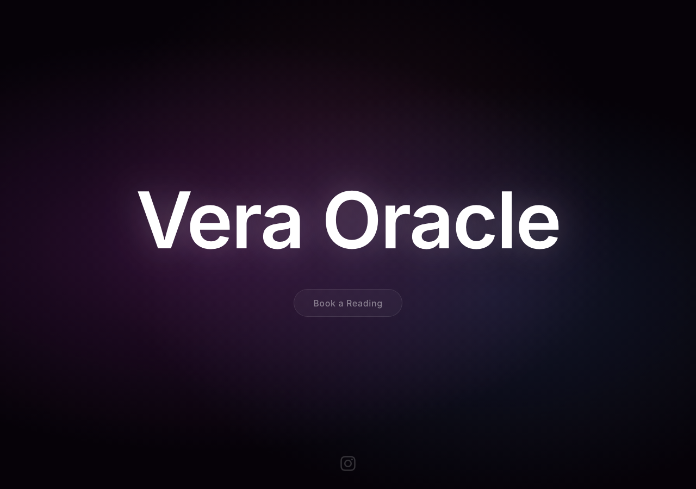
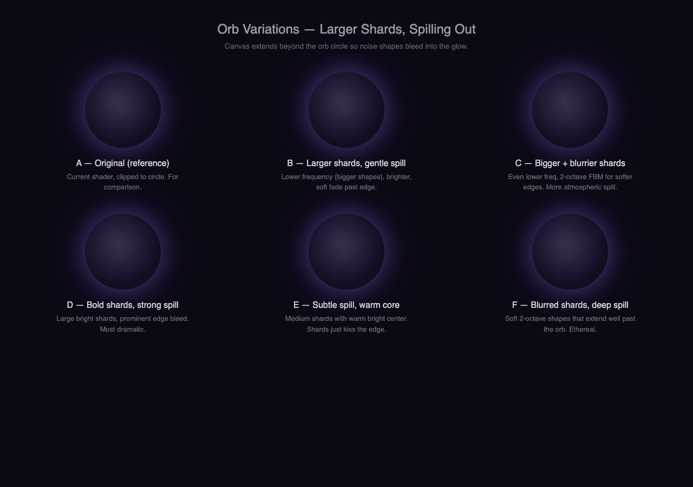
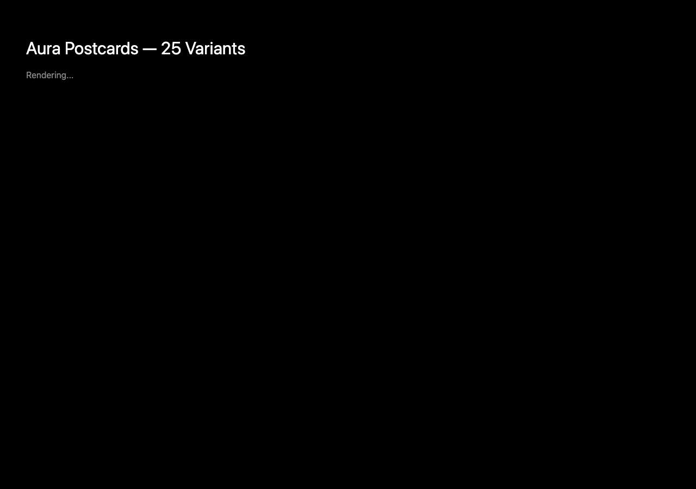
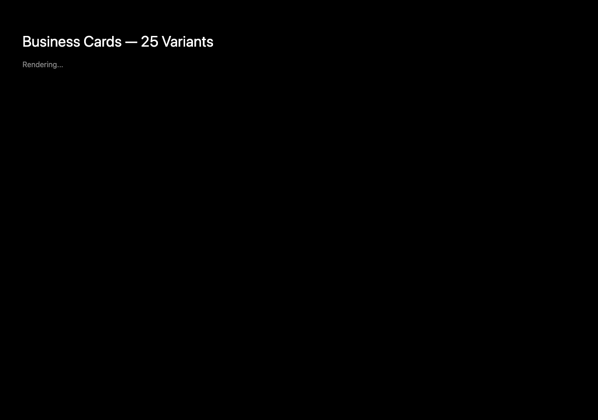

# Vera Oracle — Documentation

Visual documentation of the tarot booking site and print assets.

## Main Site

Full-screen WebGL aura shader with pointer-reactive energy, simplex noise, FBM layering, spiral tendrils. Zero-dependency static HTML.

### Live Site

Deployed at [veraoracle.com](https://veraoracle.com) on Vercel.

## Shader R&D

6 variations of the thank-you orb shader tested side-by-side: different noise frequencies, falloff functions, alpha blending approaches.

## Print Assets

### Postcards (600 DPI, 127x178mm)

25 colour palette variants for physical postcards. Text: "You were meant / to find this."

### Business Cards (600 DPI, 70x28mm)

25 matching business card variants with "Vera Oracle" branding.
